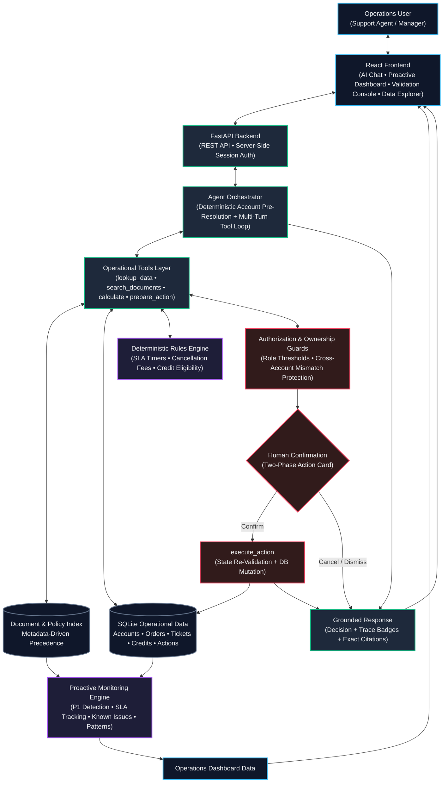

# Architecture — ParcelPilot Operations Intelligence

## 1. System Overview

**ParcelPilot Operations Intelligence** is a full-stack AI operations platform built around a simulated logistics environment. It investigates customer incidents, resolves contractual and operational policies, deterministically calculates SLAs, fees, and service credits, proactively monitors operational risks, and executes approved support actions through a two-phase confirmation protocol.

The core architectural invariant governing the platform is:

> **"The model handles reasoning and orchestration; business truth remains deterministic and verifiable."**



---

## 2. Application Architecture

The system is organized into a modular layered architecture:

1. **Presentation Layer (React + Tailwind CSS)**:
   - **AI Support Assistant**: Multi-turn operational chat with ordered step activity badges (`Document Search`, `Data Lookup`, `Calculation`, `Action`), citation pills, and interactive action confirmation cards.
   - **Proactive Issue Detection**: Automated operational grid displaying P1 critical incidents, 24x7 SLA countdowns, known-issue correlation summaries, and cross-customer pattern alerts.
   - **System Validation Console**: Test runner displaying results, decision accuracy, citation coverage, and structured inspection traces.
   - **Data & Policy Explorer**: Interactive viewer for operational tables and customer-specific policy precedence mappings.
2. **API & Authentication Layer (FastAPI)**:
   - Provides REST endpoints for chat turns, session management, proactive analysis, validation execution, action confirmation/cancellation, and operational data retrieval.
   - Enforces server-side session authentication. Clients send an `X-Session-ID` header, which the backend maps to an active user record and role (`support_agent` or `manager`). Roles cannot be forged or self-declared by client requests.
3. **Agent Orchestration Layer (`backend/agent.py`)**:
   - Performs deterministic customer account resolution from user queries prior to model execution.
   - Manages OpenAI multi-turn tool calling, handles arguments, intercepts cross-account violations, and synthesizes tool outputs into the final user-facing response.
4. **Tools Layer (`backend/tools.py`)**:
   - Implements structured operational capabilities exposed to the LLM agent via JSON function definitions.
   - Enforces role-based permissions and entity ownership guards.
5. **Deterministic Rules & Calculations (`backend/rules_engine.py`)**:
   - Pure Python business logic executing SLA timers, fee calculations, and credit determinations based strictly on governing policy specifications.
6. **Persistence & Data Storage (`backend/db.py`, SQLite)**:
   - Stores operational tables (`accounts`, `orders`, `tickets`), audit records (`actions`, `issued_credits`), and authenticated user sessions (`user_sessions`).

---

## 3. Agent Architecture

The agent orchestration layer uses an LLM (OpenAI `gpt-5-mini` with `gpt-4o-mini` fallback compatibility) strictly for natural language reasoning, information extraction, and tool choreography.

### Orchestration Loop
1. **Context Initialization**: The incoming user message is received along with the validated server-side session context (`role`, `user_id`, `session_id`).
2. **Deterministic Pre-Resolution**: The orchestrator scans the message text for known customer aliases (e.g., "Northstar", "LumenWorks", "Beacon Retail", "Axis Labs"). The resolved account ID is verified against the database and stored in the session context as trusted system metadata.
3. **Model Invocation with Tool Schemas**: The conversation history and system instructions are submitted with native function-calling tool definitions.
4. **Iterative Function Calling**: When the model emits tool calls:
   - Arguments are validated against backend schemas.
   - Tool execution is intercepted if account ownership guards or role restrictions are violated.
   - Tool outputs and harvested citations are returned to the model as `tool` role messages.
5. **Final Synthesis**: Once tool execution completes, the model produces a concise natural language explanation referencing the tool results and citing governing document sections.

### Invariant: The LLM Does Not Own Business Truth
The language model is explicitly barred from performing arithmetic, computing elapsed times, establishing SLA breach states, deciding fee amounts, or mutating database records in memory. If an operational calculation is required, the model must invoke the `calculate` tool; if an operational change is requested, it must invoke `prepare_action`.

---

## 4. Tool Architecture

The agent interacts with the operational environment exclusively through five structured tools:

| Tool Name | Parameters | Purpose & Execution Guarantees |
|---|---|---|
| `lookup_data` | `entity` (`account`, `order`, `ticket`), `identifier`, `account_id` | Queries SQLite operational tables. Enforces cross-account consistency: if an order does not belong to the resolved customer account, access is blocked with `ACCOUNT_MISMATCH`. |
| `search_documents` | `query`, `topic`, `account_id`, `include_historical` | Retrieves governing policy sections from the structured metadata index. Binds customer account overrides automatically and excludes deprecated policies unless historical context is explicitly requested. |
| `calculate` | `calculation_type` (`cancellation_fee`, `service_credit`, `sla_target`), `inputs` | Invokes `rules_engine.py` to deterministically evaluate business logic. Re-checks account ownership (`INVALID_ACCOUNT_OWNERSHIP`) before computing financial or SLA values. |
| `prepare_action` | `action_type` (`cancel_order`, `issue_credit`, `escalate_ticket`), `parameters`, `reasoning` | Stages a state-changing action into a `pending_confirmation` record in SQLite. Enforces role-based financial thresholds (e.g., rejecting credits > ₹1,000 for support agents with `INSUFFICIENT_AUTHORITY`). Does not mutate operational records. |
| `execute_action` | `action_id`, `user_context`, `confirmed_by_user` | Triggered only after explicit human confirmation. Re-verifies live database milestone status (e.g., ensuring an order is not `PICKED_UP`), commits the mutation, and logs an audit record. |

---

## 5. Document & Structured Data Handling

Operational knowledge is segregated into distinct tiers to maintain absolute source fidelity:

### Operational Data (SQLite)
Contains tabular records representing the operational snapshot:
- `accounts`: Plan tier, CSM name, contract filename, premium support status.
- `orders`: Account ID, order status, pickup and delivery timestamps, carrier name, origin/destination.
- `tickets`: Account ID, subject, description, priority/severity, created timestamp, historical resolution notes.
- `actions`: Prepared, confirmed, executed, and cancelled operational actions with parameters and audit details.
- `issued_credits`: Granted service credits with amount, order ID, account ID, authorized role, and timestamp.

### Structured Document Index (`backend/docs_index.py`)
Rather than relying on unstructured text chunks in a vector database, documents are indexed with explicit metadata tags (`document_id`, `title`, `account_id`, `topic`, `priority`, `authoritative`, `section`):

1. **Signed Customer Agreements (Priority 100)**:
   - `05_Northstar_Logistics_Enterprise_Agreement.pdf`: Overrides cancellation fees (₹0 for BOOKED shipments before pickup) and SLA response targets (P1 15m 24x7, P2 1h 24x7, P3 8h 24x7). Specifies monthly credit cap (₹5,000).
   - `06_LumenWorks_Service_Agreement.pdf`: Overrides service credits (flat ₹300 for carrier delays >4 hours) and SLA targets (P1 2h, P2 4h, P3 2d; excludes weekends and after-hours). Defers cancellation fees to general SOP.
2. **Current Policies & SOPs (Priority 50)**:
   - `01_Support_Policy_v3_CURRENT.pdf`: Defines default severity levels (P1-P3) and plan-based SLA response targets (Enterprise, Growth, Standard).
   - `03_Cancellation_and_Service_Credit_SOP_v4.pdf`: Defines standard tiered cancellation fees (₹0 within 30m; ₹250 after 30m if still BOOKED; Return-to-Origin if PICKED_UP), standard pickup delay credit eligibility (>2h carrier delay, 20% order value capped at ₹1,000), and role authorization rules.
3. **Operations Guides & Technical Context (Priority 10)**:
   - `04_Product_Operations_Guide_and_Known_Issues.pdf`: Documents platform limits and active/resolved known issues (KI-208 bulk upload failures on CSVs > 3,000 rows; KI-211 SwiftShip 20-min webhook delay; resolved KI-176 address validation bug).
4. **Historical & Deprecated Materials (Priority 0)**:
   - `02_Support_Policy_v2_DEPRECATED.pdf`: Superseded by v3 on 1 Jan 2025. Strictly tagged as non-authoritative (`authoritative: false`) and filtered out of standard document searches.

---

## 6. Source Reliability & Conflict Handling

The platform enforces strict rules when resolving conflicting information:

1. **Contractual Precedence**: When customer terms conflict with standard policy, terms in the signed customer agreement automatically supersede baseline rules.
2. **Non-Authoritative Historical Resolutions**: Historical ticket notes (`historical_resolution` in `tickets`) often contain outdated or incorrect guidance (such as citing a ₹250 fee for a Northstar cancellation). The system marks these notes as non-authoritative, analyzes them against governing agreements, and explicitly corrects the operator.
3. **Deterministic Account Pre-Resolution**: To eliminate model hallucinations in entity selection, account identities are resolved using deterministic pattern matching on the user input before invoking the LLM.
4. **Account Ownership Interception**: When a user request references an order belonging to Customer A while discussing Customer B, the tool layer rejects the operation with `ACCOUNT_MISMATCH` before any document lookup or calculation can proceed.

---

## 7. Authorization & Account Isolation

Security and compliance boundaries are enforced through defense-in-depth mechanisms:

### Server-Side Session Authentication
- User sessions are created via `POST /api/login` and assigned an immutable role (`support_agent` or `manager`).
- Client requests cannot declare or escalate roles via body payload or headers.

### Role-Based Thresholds
- Under SOP v4 §3, any individual service credit exceeding **₹1,000** strictly requires manager approval.
- When a `support_agent` attempts to prepare or execute a credit > ₹1,000, `prepare_action` halts immediately with:
  ```json
  {
    "status": "rejected",
    "error_code": "INSUFFICIENT_AUTHORITY",
    "message": "Credits exceeding INR 1,000 require manager role authorization."
  }
  ```

### Structural Cross-Account Isolation
- Every database query for orders, tickets, and accounts filters by the authenticated or resolved account context.
- If tool parameters supply conflicting identifiers, the backend aborts execution with `INVALID_ACCOUNT_OWNERSHIP` or `ACCOUNT_MISMATCH`.

---

## 8. Safe Action Execution

State mutations follow a strict **Two-Phase Action Pattern**:

```
[User Request]
       │
       ▼
[Agent: prepare_action] ──► Validates inputs & role authority
       │                    Persists action with status: "pending_confirmation"
       ▼
[Frontend UI Card] ───────► Operator reviews: Action Type, Target, Financial Impact
       │
       ├─► [Operator Cancels] ──► Action status: "cancelled" (No DB mutation)
       │
       └─► [Operator Confirms] ──► POST /api/actions/{action_id}/confirm
                                         │
                                         ▼
                                  [execute_action]
                                  • Re-validates current order milestone in DB
                                  • Verifies action expiry window (24h)
                                  • Re-checks role authorization
                                  • Commits mutation to SQLite
                                  • Writes immutable audit entry
```

### Safety Guarantees
- **Live Re-Validation**: If an order progresses from `BOOKED` to `PICKED_UP` between preparation and confirmation, `execute_action` blocks the cancellation, leaves the order status unchanged, and directs the user to initiate a Return-to-Origin workflow.
- **Audit Persistence**: Every confirmed credit is written to the `issued_credits` table with timestamp, operator ID, role, amount, and order ID.

---

## 9. Proactive Operations Monitoring

The proactive detection engine (`backend/proactive.py`) continuously analyzes operational data without relying on user queries:

1. **P1 Critical Incident Surfacing**:
   - Detects system outages (e.g., TKT-501 HTTP 500 errors) and security vulnerabilities (e.g., TKT-505 exposed API keys).
   - Maps each incident to the customer's governing SLA (e.g., 15-minute 24x7 target for Northstar, 30-minute 24x7 target for Axis Labs).
2. **Deterministic 24x7 SLA Monitoring**:
   - Evaluates active incidents against the dataset reference snapshot (`2026-08-16T11:00:00+05:30` Asia/Kolkata).
   - Computes exact elapsed wall-clock minutes and tags status as `BREACHED` or `Within Target`.
3. **Calendar Undefined Behavior**:
   - For open tickets with business-hour SLAs (e.g., "4 business hours", "2 business days"), the engine avoids inventing an ungrounded 9-to-5 working calendar.
   - It outputs raw elapsed wall-clock time and transparently classifies the SLA status as **`Calendar Undefined`**.
4. **Known Issue Correlation**:
   - Compares ticket descriptions against known bugs using deterministic keyword and regex heuristics.
   - Correlates KI-208 (bulk upload failures on CSVs > 3,000 rows) and KI-211 (SwiftShip webhook delay up to 20 minutes).
   - Suppresses correlation against resolved issues (KI-176) unless explicit historical evidence matches.
5. **Cross-Customer Pattern Detection**:
   - Groups open tickets by failure signatures to identify cross-customer systemic issues before multiple accounts escalate.

---

## 10. Technical Trade-offs

| Design Choice | Alternative Considered | Rationale |
|---|---|---|
| **Server-Side Session Store** | Full OAuth2 / OIDC / SSO | Fast, self-contained implementation suitable for local and cloud deployment, focusing engineering effort on backend authorization logic and account isolation. |
| **Structured Metadata Index** | Vector Database (Embeddings) | For a bounded set of authoritative policies (6 documents), metadata tagging guarantees deterministic retrieval, prevents cross-contract blending, and ensures 100% exact section citations. |
| **Synchronous Agent Turns** | Streaming Tokens (SSE / WebSockets) | Full-turn synchronous responses allow the backend to package structured tool traces, harvested citations, and action cards into a single verified JSON payload. |
| **Calendar Undefined Classification** | Fabricating Default Business Hours (9–5 M–F) | Adheres strictly to source document truth. Inventing operational calendars would introduce ungrounded business assumptions into SLA calculations. |
| **Individual vs. Aggregate Credit Limits** | In-memory credit tallying | Without a multi-month historical credit ledger in the provided dataset, the engine enforces individual credit limits deterministically while explicitly documenting the monthly aggregate cap in calculation explanations. |

---

## 11. Future Architecture

The modular design enables incremental future enhancements:

1. **Carrier Webhook Ingestion Pipeline**: Ingest real-time tracking webhooks to automatically clear transient webhook lag anomalies (KI-211) and update shipment milestones without manual intervention.
2. **Persistent Multi-Month Credit Ledger**: Track historical credits per account over time to enforce aggregate monthly caps (e.g., Northstar's ₹5,000 monthly limit) automatically.
3. **Automated Notification Gateway**: Dispatch instant P1 incident notifications via Slack, email, or PagerDuty to designated Customer Success Managers (CSMs) and on-call engineering leads.
4. **Configurable Tenant Calendar Service**: Enable enterprise customers to define their operating calendars (shift times, holiday calendars, regional timezones) to allow deterministic evaluation of business-hour SLAs.
